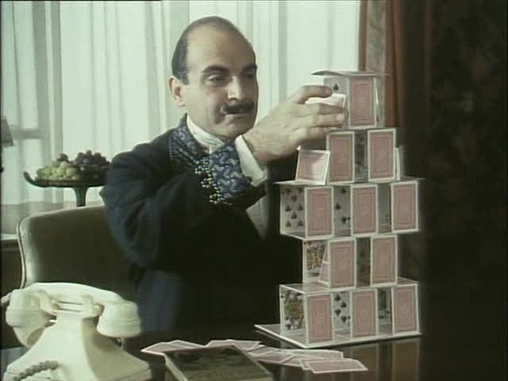
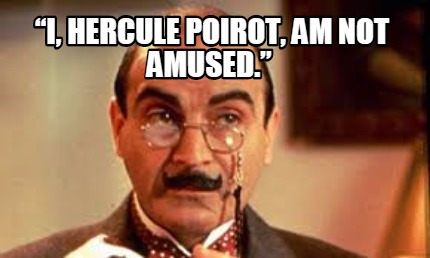

# Herkules Poirot
## **Detektyw**
### *Geniusz*
#### Perfekcjonista

|Dane osobowe| |
|---|---|
|Imię | Herkules |
|Nazwisko | Poirot |
|Pochodzenie | belgijskie |
|Zawód | detektyw |
|Wygląd | niski wzrost, starannie pielęgnowane wąsy, ubiór dandysa |
|Cechy charakterystyczne | obsesja na punkcie porządku i symetrii,  pogarda wobec klasycznych metod detektywistycznych,  rozwiązuje sprawy przy pomocy psychologii zbrodni |
|Stan cywilny | Kawaler|




[Wysublimowane podniebienie Herkulesa Poirot](https://youtu.be/kB0Hg7nBPJQ)

Powieści z Herkulesem Poirot:

- "Tajemnicza historia w Styles"
- "Morderstwo na polu golfowym"
- "Zabójstwo Rogera Ackroyda"
- "Wielka czwórka"
- "Tajemnica Błękitnego Expressu"
- "Samotny Dom"
- "Śmierć lorda Edgware’a"
- "Morderstwo w Orient Expressie" 
- "Czarna kawa" 
- "Tragedia w trzech aktach" 
- "Śmierć w chmurach" 
- "A.B.C." 
- "Morderstwo w Mezopotamii" 
- "Karty na stół" 
- "Śmierć na Nilu" 
- "Niemy świadek" 
- "Rendez-vous ze śmiercią" 
- "Boże Narodzenie Herkulesa Poirota" 
- "Pierwsze, drugie... zapnij mi obuwie" 
- "Zerwane zaręczyny" 
- "Zło, które żyje pod słońcem" 
- "Pięć małych świnek" 
- "Niedziela na wsi" 
- "Pora przypływu" 
- "Pani McGinty nie żyje" 
- "Po pogrzebie" 
- "Entliczek pentliczek" 
- "Zbrodnia na festynie" 
- "Kot wśród gołębi" 
- "Przyjdź i zgiń"
- "Trzecia lokatorka" 
- "Wigilia Wszystkich Świętych" 
- "Słonie mają dobrą pamięć" 
- "Kurtyna"




Postaci towarzyszące Herkulesowi Poirot:

1. Arthur Hastings
2. Ariadne Oliver
3. panna Felicity Lemon
4. inspektor Japp
5. pułkownik Race
6. George


```
ankieta <- c("T", "N", "T", "T", "X", "N", "T", "X", "N", "T", "N", "T", "T", "N", "X", "N", "T", "N", "T", "T")
factor(ankieta)
table(ankieta)
```

```{r message=FALSE}
library(ggplot2)
ggplot(data=diamonds, aes(price))+
  geom_histogram(col="blue", fill="pink")
```

```{r}
library(knitr)
kable(mtcars[1:5], caption = "a knitr kable")
```

```{r echo=FALSE}
library(ggplot2)
ggplot(diamonds)+
 geom_point(aes(carat, price))
```

